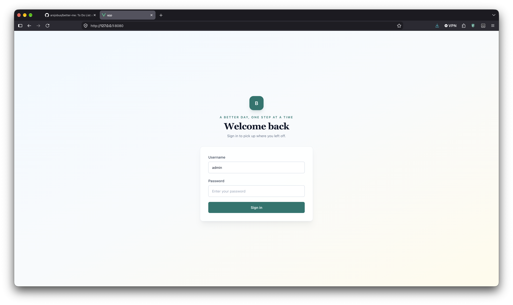

# better-me
Tasking Management with AI as an Accountability Coach

Run an AI Coach locally using Ollama and model of your choice

## Use Cases

As a user, I want to manage a list of tasks from multiple devices,
So that I can access and update my task completion.

As a user, I want to be notified by an AI Coach interruptively,
So that I can be reminded to complete every task.

As a user, I want my tasks to reset to be incomplete at 8 AM tomorrow,
So that I can be reminded to complete my tasks everyday.

## App

This App allows the users to create and manage tasks.

1) CD into 'app' directory.
2) Install dependencies `npm install`
3) Copy `.env-example` to `.env`
4) In the .env file, fill in 'VUE_APP_API_BASE_URL' as http://localhost:3000.
5) Run locally with `npm run serve`

## API

This API is consumed by the App.

1) CD into 'api' directory.
2) Install dependencies `npm install`
3) Copy `.env-example` to `.env`
4) In the .env file, fill in 'REDIS_URL' as the local or remote Redis Base URL.
5) In the .env file, fill in 'REDIS_TOKEN' as token / password used to authenticate to Redis.
6) In the .env file, fill in 'JWT_SECRET' as a strong JWT sercet.
7) In the .env file, fill in 'ADMIN_USERNAME' as a username of your choice.
8) In the .env file, fill in 'ADMIN_PASSWORD' as a password of your choice.
9) Run locally with `npm run dev`

Note: Username / Password used to login to the app.

## AI Coach

AI Coach uses TTS to speak aloud the coaching text output from LLM service.

### Prerequisites

Install Ollama and pull the `qwen3:8b` model with `ollama pull qwen3:8b`.

1) CD into 'coach' directory.
2) Make venv `python -m venv .venv`
3) Activate the venv `source .venv/bin/activate`
4) Install dependencies `python -m pip install -r requirements.txt`
5) In the .env file, set 'OLLAMA_API_URL' to `http://localhost:11434/api/`.
6) In the .env file, set 'OLLAMA_MODEL' to `qwen3:8b`.
7) In the .env file, fill in 'REDIS_URL' as the local or remote Redis Base URL.
8) In the .env file, fill in 'REDIS_TOKEN' as token / password used to authenticate to Redis.
9) Run with `python main.py`. It stays running, polls Redis every 60 seconds, and speaks a reminder when incomplete tasks change or after the 30-minute cooldown. Set `COACH_POLL_INTERVAL_SECONDS` and `COACH_REMINDER_INTERVAL_SECONDS` in `.env` to change those intervals. Press Ctrl+C to stop it.

Local Docker stack (works with Rancher Desktop)

1) Start Rancher Desktop, enable the Docker backend, and ensure the `docker` command is available in your shell.
2) From the project root, run `docker compose up --build`.
   - If your Rancher Desktop install exposes `nerdctl` instead, use `nerdctl compose up --build`.
3) The Redis service will start on `localhost:6379`.
4) The API will run on `http://localhost:3000`.
5) The Vue app will run on `http://localhost:8080`.
6) For the coach, run `docker build -t ollama-service ./coach` and `docker run -p 11434:11434 ollama-service`.

Finished.